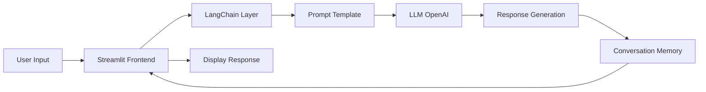

<div align="center">

# 🤖 Chatbot with LangChain & Streamlit

[](https://www.python.org/)
[](https://www.langchain.com/)
[](https://streamlit.io/)
[](https://openai.com/)

**Interactive Conversational AI System Built with LangChain and Streamlit**

</div>

---

## 📖 Overview

This project implements an intelligent conversational chatbot leveraging the **LangChain** framework and **Streamlit** for the user interface. The system demonstrates modern AI engineering practices, including prompt engineering, conversation memory management, and seamless integration with Large Language Models (LLMs).

The chatbot provides context-aware responses, maintains conversation history, and offers a clean, intuitive web interface for user interactions.

---

## 🎯 Key Features

- **🧠 LangChain Integration:** Utilizes LangChain's powerful chains and agents for sophisticated language processing
- **💬 Conversation Memory:** Maintains context across multiple turns for coherent dialogues
- **🎨 Streamlit UI:** Clean, responsive web interface built with Streamlit
- **🔌 Modular Architecture:** Easy to extend with custom prompts, tools, and integrations
- **⚡ Real-time Responses:** Fast inference with streaming support
- **🔐 Secure API Management:** Environment-based configuration for API keys

---

## 🏗️ Architecture / Pipeline



### **Architecture Flow:**

1. **User Interface Layer (Streamlit):** Captures user input and displays responses
2. **LangChain Processing Layer:** Manages conversation flow, memory, and prompt engineering
3. **LLM Integration:** Connects to OpenAI API for language generation
4. **Memory Management:** Stores conversation history for context-aware responses
5. **Response Rendering:** Formats and displays AI-generated responses

---

## 🛠️ Tech Stack

- **Language:** Python 3.8+
- **Framework:** LangChain
- **UI:** Streamlit
- **LLM Provider:** OpenAI GPT-3.5/4
- **Environment Management:** python-dotenv
- **Dependencies:** langchain, streamlit, openai, python-dotenv

---

## 🚀 How to Run

### Prerequisites
```bash
# Python 3.8+ required
python3 --version

# OpenAI API key (get from https://platform.openai.com/)
```

### Installation

1. **Clone the repository:**
```bash
cd /home/sergio/my-project/My-Portfolio/Chatbot-LangChain-Streamlit
```

2. **Create and activate virtual environment:**
```bash
python3 -m venv venv
source venv/bin/activate
```

3. **Install dependencies:**
```bash
pip install -r requirements.txt
```

4. **Configure environment variables:**
```bash
# Create .env file
echo "OPENAI_API_KEY=your_api_key_here" > .env
```

5. **Run the application:**
```bash
streamlit run app.py
```

6. **Access the chatbot:**
- Open browser at: `http://localhost:8501`

---

## 💡 Key Learnings

### **Technical Insights:**
- **Prompt Engineering:** Mastered crafting effective prompts to guide LLM behavior
- **Conversation Memory:** Implemented buffer memory for context retention across chat sessions
- **LangChain Chains:** Learned to build sequential chains for complex reasoning tasks
- **Streamlit Session State:** Managed application state for persistent user experiences

### **Best Practices:**
- API key security through environment variables
- Modular code structure for maintainability
- Error handling for API failures and rate limits
- User experience optimization with loading states and clear feedback

### **Challenges Overcome:**
- Managing conversation context without exceeding token limits
- Implementing efficient memory strategies for long conversations
- Optimizing response times while maintaining quality

---

## 📁 Project Structure

```
Chatbot-LangChain-Streamlit/
├── app.py                 # Main Streamlit application
├── requirements.txt       # Python dependencies
├── .env.example          # Environment variables template
├── .gitignore            # Git ignore rules
└── README.md             # Project documentation
```

---

## 🔮 Future Enhancements

- [ ] Add support for multiple LLM providers (Anthropic, Cohere, local models)
- [ ] Implement RAG (Retrieval-Augmented Generation) with document upload
- [ ] Add conversation export functionality
- [ ] Integrate voice input/output
- [ ] Deploy to cloud platform (Streamlit Cloud, Heroku, AWS)
- [ ] Add user authentication and conversation persistence

---

## 📝 License

This project is part of the [Sergio Arnold Portfolio](../) and follows the repository's license.

---

## 🤝 Contributing

Contributions, issues, and feature requests are welcome! Feel free to check the main portfolio repository.

---

<div align="center">

**Built with 🧠 and ☕ by [Sergio Arnold](https://github.com/sergioarnold87)**

[⬅️ Back to Portfolio](../)

</div>
